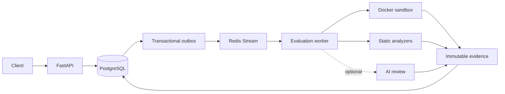
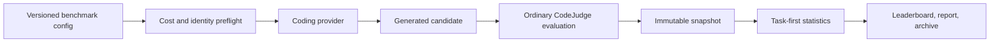

# CodeJudge AI

[](https://github.com/yunusemreyazici/codejudge-ai/actions/workflows/ci.yml)
[](https://www.python.org/downloads/)
[](https://github.com/yunusemreyazici/codejudge-ai/releases)
[](LICENSE)

> A distributed evaluation and benchmarking platform for AI-generated Python.

CodeJudge AI turns generated source into executable, reproducible evidence. It runs official tests
inside restricted Docker containers, performs deterministic static analysis, stores immutable
PostgreSQL snapshots, and compares coding models over versioned task portfolios. Optional AI review
is recorded beside the deterministic result and never changes its score or rank.

The core evaluator, Docker sandbox, analyzers, durable workers, AI-assisted review, and multi-model
benchmark workflow are implemented and covered by CI. The release badge above tracks the latest
published GitHub tag.

> [!CAUTION]
> Docker strengthens isolation but is not a perfect security boundary. The Docker daemon, runtime,
> and host kernel remain trusted. Never use the development-only `local` runner for untrusted code.
> Read the [sandbox security model](docs/sandbox/security-model.md) before exposing CodeJudge to
> hostile public submissions.

## What CodeJudge provides

- **Sandboxed execution** — fresh non-root, no-network containers with read-only code, bounded
  writable storage, CPU, memory/swap, PID, time, log, and output limits.
- **Deterministic evaluation** — versioned public tasks and official private tests, with structured
  correctness evidence and fail-closed infrastructure handling.
- **Static analysis** — Ruff, mypy, Bandit, and Radon findings over the exact submitted source.
- **Durable processing** — FastAPI, PostgreSQL, Redis Streams, transactional outboxes, renewable
  leases, bounded retries, idempotency, and stale-worker recovery.
- **Reproducible snapshots** — source, task, tests, analyzers, scoring policy, runtime, sandbox, and
  optional AI provenance captured together.
- **Model benchmarking** — repeated samples, task-first aggregation, coverage and reliability
  metrics, cost preflight, historical comparison, and verifiable offline archives.

## System at a glance



PostgreSQL is the lifecycle authority; Redis is recoverable delivery infrastructure. Worker
delivery is at least once, while atomic claims, leases, identity validation, and transactional
finalization prevent stale or duplicate successful completion.

Benchmarking reuses the same evaluator rather than creating a privileged execution path:



Coding providers see only public task specifications. Hidden tests and reference implementations
stay outside candidate and provider contexts. Generated source remains untrusted and enters the
same Docker and analyzer pipeline as a direct submission.

## Deterministic scoring

The scoring policy is versioned independently from application releases. When every analyzer
dimension is available, policy version `1` uses:

| Dimension | Weight |
| --- | ---: |
| Correctness | 60% |
| Code quality | 15% |
| Type safety | 10% |
| Security | 10% |
| Complexity | 5% |

If static analysis is disabled, the final score is correctness-only. Analyzer infrastructure
failure fails the evaluation rather than silently manufacturing partial weighted scores. A
correct benchmark evaluation must report zero failed official tests and the expected authoritative
test count; a high composite score is not a substitute for correctness.

See [scoring](docs/evaluation/scoring.md), [correctness](docs/evaluation/correctness.md), and
[static analysis](docs/evaluation/static-analysis.md) for the exact semantics.

## Latest benchmark results

The latest completed broad screening runs used `codejudge-core@2`, a seven-task engineering
portfolio. The headline is the eligible winner under the strict completeness policy.

`codejudge-core@3` expands the available portfolio to twelve tasks. The published results below
remain historical v2 results and are not results for the expanded dataset; no model/provider runs
were made to populate v3 during the dataset implementation.

| Benchmark | Eligible winner | Primary mean | Generation success | Evaluation coverage |
| --- | --- | ---: | ---: | ---: |
| ClinePass, 12 models | GLM-5.2 | 90.49 | 100.0% | 100.0% |
| OpenRouter paid, 17 models | GPT-5.6 Luna | 92.87 | 100.0% | 100.0% |
| OpenRouter free, 11 models | Nemotron 3 Super Free | 80.14 | 100.0% | 100.0% |

Those percentages are model-level metrics for the named eligible winner. Overall reliability across
all configured models was lower:

| Benchmark | Overall run generation success | Overall run evaluation coverage |
| --- | ---: | ---: |
| ClinePass, 12 models | 73/84 (86.9%) | 73/84 (86.9%) |
| OpenRouter paid, 17 models | 72/119 (60.5%) | 72/119 (60.5%) |
| OpenRouter free, 11 models | 25/77 (32.5%) | 22/77 (28.6%) |

Winner eligibility requires 100% model-level generation success and 100% model-level evaluation
coverage across planned samples. Low-coverage observed leaders therefore do not become headline
winners. These one-sample-per-task smoke runs are broad screening benchmarks, not statistically
precise rankings.

In the preserved repeated 3× panel, both models had full coverage: Kimi K2.7 Code recorded 88.14
with a 95% observed interval of `[82.36, 93.91]`; DeepSeek V4 Pro recorded 75.71 with
`[63.54, 87.88]`. Repeated samples support stability and uncertainty reporting, but still describe
only the recorded dataset and provider conditions.

Read the full [historical results](docs/benchmarks/results.md) for observed winners, run IDs,
fingerprints, execution-time versions, reliability, costs, and interpretation cautions.

## Quick start

Requirements: Python 3.13+, `uv`, Docker, PostgreSQL 17, and Redis 7.

```bash
git clone https://github.com/yunusemreyazici/codejudge-ai.git
cd codejudge-ai
uv sync --extra dev
docker compose up -d postgres redis
docker build -t codejudge-python-sandbox:phase2 sandbox/
```

Start the API in synchronous mode with persistence disabled:

```bash
uv run uvicorn app.main:app --reload
```

Open [http://127.0.0.1:8000/docs](http://127.0.0.1:8000/docs), list the public tasks, or submit the
included LRU implementation:

```bash
curl --fail-with-body http://127.0.0.1:8000/api/v1/tasks

python -c 'import json, pathlib; print(json.dumps({
  "task_id": "lru-cache",
  "language": "python",
  "code": pathlib.Path("examples/lru_cache.py").read_text()
}))' | curl --fail-with-body \
  -H 'Content-Type: application/json' \
  --data-binary @- \
  http://127.0.0.1:8000/api/v1/evaluations
```

For PostgreSQL-backed asynchronous workers, migrations, Redis, and deployment settings, continue
with [Getting started](docs/getting-started.md) and [Deployment](docs/operations/deployment.md).

## Benchmark workflow

Commit-safe examples contain logical provider identities and environment-variable names, never
endpoint values or credentials. Copy a tracked example and replace its placeholders locally:

```bash
cp benchmark-configs/real-smoke.example.yaml benchmark-configs/real-smoke.yaml
uv run codejudge-benchmark plan benchmark-configs/real-smoke.yaml
```

`plan` is provider-free. It expands every model × task × sample, validates identities and pricing,
and enforces the configured hard budget before any generation is queued. `run` is the explicit
provider-execution boundary.

```bash
uv run codejudge-benchmark probe benchmark-configs/real-smoke.yaml --model model-a
uv run codejudge-benchmark run benchmark-configs/real-smoke.yaml
uv run codejudge-benchmark status <RUN_ID>
uv run codejudge-benchmark report <RUN_ID>
uv run codejudge-benchmark archive <RUN_ID>
uv run codejudge-benchmark verify-archive benchmark-results/runs/<RUN_ID>
```

Only `probe` and `run` contact a configured coding provider. Historical `list`, `show`, `compare`,
`export`, `report`, and offline `verify-archive` operate on stored evidence. Provider secrets must
remain in environment variables and are never persisted in benchmark configs.

See [benchmark methodology](docs/benchmarks/methodology.md), [providers and budgets](docs/benchmarks/providers.md),
and [reproducibility](docs/benchmarks/reproducibility.md) before running a paid comparison.

## Documentation

| Area | Start here |
| --- | --- |
| Setup and API | [Getting started](docs/getting-started.md) |
| Design | [Architecture](docs/architecture.md) |
| Evaluation semantics | [Scoring](docs/evaluation/scoring.md) and [correctness](docs/evaluation/correctness.md) |
| Sandbox | [Security model](docs/sandbox/security-model.md) and [resource limits](docs/sandbox/resource-limits.md) |
| Benchmarking | [Methodology](docs/benchmarks/methodology.md), [statistics](docs/benchmarks/statistics.md), [results](docs/benchmarks/results.md) |
| Operations | [Database](docs/operations/database.md), [workers](docs/operations/workers.md), [deployment](docs/operations/deployment.md) |
| Development | [Testing](docs/development/testing.md) and [release process](docs/development/release-process.md) |

The complete map is in the [documentation index](docs/README.md).

## Project status

Implemented releases cover the core evaluator (Phase 1), Docker sandbox (Phase 2), deterministic
analysis and scoring (Phase 3), immutable persistence (Phase 4), Redis workers (Phase 5), optional
AI review (Phase 6), and the versioned benchmark platform with datasets, real-provider workflow,
metric hardening, archives, repeated-sample statistics, and eligible-winner reporting (Phase 7).

The next planned work is production observability and operations hardening. Existing behavior is
conservative by design: unavailable infrastructure fails closed, missing benchmark observations
stay missing, unknown cost is not treated as free, and hosted-model nondeterminism is disclosed.

## Development

```bash
uv run ruff check .
uv run ruff format --check .
uv run mypy app
uv run pytest -v -m "not sandbox and not database and not queue"
```

Infrastructure suites have explicit safety requirements. In particular, destructive database
tests accept only the dedicated `CODEJUDGE_TEST_DATABASE_URL`, require a database name ending in
`_test`, and require an explicit opt-in. Use the exact commands in [Testing](docs/development/testing.md).

Contributions should preserve the separation between routes, durable orchestration, untrusted-code
execution, deterministic evidence, optional AI evidence, and reporting. Open an
[issue](https://github.com/yunusemreyazici/codejudge-ai/issues) to discuss larger changes.

## License

CodeJudge AI is available under the [MIT License](LICENSE).
