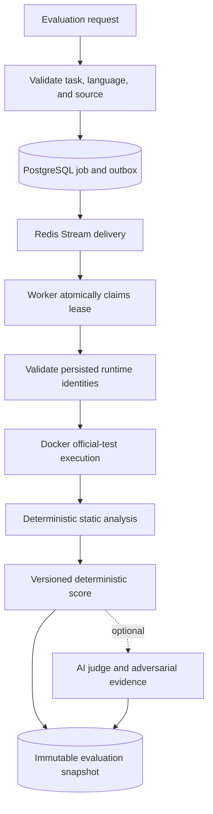
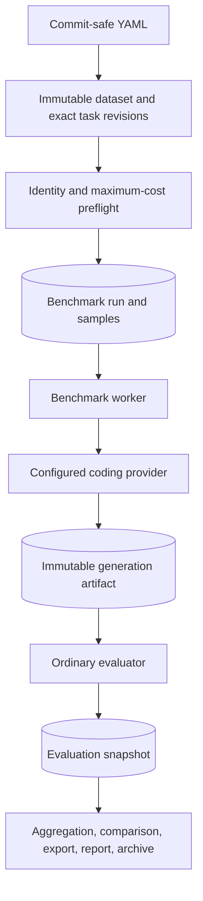

# Architecture

[← Project README](../README.md) · [Documentation index](README.md)

CodeJudge AI separates request handling, durable orchestration, untrusted execution, deterministic
analysis, optional AI evidence, and reporting. This prevents infrastructure concerns or model
output from silently changing deterministic scoring.

## Evaluation flow

Synchronous compatibility mode enters the same evaluation engine without the job/stream path.
Runners implement a typed boundary, so the engine does not know whether execution is local or
containerized. Routes translate HTTP data and do not query SQLAlchemy directly.

## Durable ownership

PostgreSQL owns job and benchmark lifecycle. Redis carries recoverable notification messages but
is not the source of truth. The API atomically inserts a queued job and outbox event. A publisher
adds the outbox UUID to a Redis Stream and marks it published only after `XADD` succeeds.

Workers use atomic claims and renewable PostgreSQL leases. Delivery is at least once:

- duplicate terminal deliveries are acknowledged without rerunning source;
- expired claims can be recovered by another worker;
- ownership loss cancels active work;
- renewal at or after persisted expiry cannot succeed;
- stale owners cannot finalize;
- snapshot insertion and the terminal lifecycle transition share one transaction.

The worker validates persisted source, task/test, analyzer, scoring-policy, CodeJudge runtime, and
sandbox image identities before execution. Drift becomes an integrity failure, not a silent rerun
under different semantics.

## Evaluation boundaries

The deterministic pipeline contains three distinct concerns:

1. The runner executes official tests and returns structured counts, timing, timeout, OOM, and
   sanitized failure evidence.
2. The static-analysis engine examines the exact candidate bytes without importing the module.
3. The scoring policy converts available deterministic evidence into versioned dimension scores.

AI-assisted evaluation is supplemental. Judge output and generated adversarial tests cannot mutate
official test evidence, the deterministic score, or benchmark rank. The AI pipeline has strict
local schemas, bounded inputs/outputs, separate provenance, and explicit partial/unavailable states.

Judge panels store individual results, use a median aggregate, and suppress the aggregate AI score
when disagreement exceeds policy. Adversarial tests follow `generate → structural validation →
trusted reference Docker run → candidate Docker run`; a generated test counts only after the
reference passes it. Zero valid generated tests produces no robustness score. Provider timeout,
rate limit, refusal, malformed response, or generation failure can make AI `partial`, `unavailable`,
`disputed`, or `skipped` while the deterministic snapshot still commits normally.

## Benchmark flow

The provider receives the versioned public coding prompt only. A generated candidate is persisted
only when nonblank and is then evaluated as untrusted source. Benchmark aggregation reads stored
artifacts and snapshots; it does not rerun providers or evaluations.

Task identity separates a human-facing logical ID from an immutable integer evaluator revision.
Released task directories are revision 1; additional revisions can coexist in explicit numbered
subdirectories. Ordinary API task listing uses a deliberately configured default once per logical
task. Dataset execution is stricter: manifests bind an exact revision, and planning, evaluator
fingerprinting, worker execution, trusted official cases, and mutation auditing resolve that exact
identity without a `latest` fallback. Historical manifests that omit the field canonically mean
revision 1, preserving their bytes and dataset fingerprints.

## Trust boundaries

| Component | Trust position |
| --- | --- |
| Candidate source | Untrusted |
| Coding-provider output | Untrusted source |
| AI judge output and generated tests | Untrusted, locally validated supplemental evidence |
| Task definitions, official tests, references | Trusted, repository-versioned evaluator material |
| Supervisor, Docker daemon/runtime, host kernel | Trusted infrastructure |
| PostgreSQL | Durable lifecycle and immutable evidence authority |
| Redis | Recoverable delivery transport |

Official assertions, expected values, future operations, references, host paths, and credentials do
not enter candidate workspaces. Candidate containers never receive the Docker socket.

## Failure ownership

- Candidate syntax, test failure, timeout, authoritative OOM, and ordinary findings are completed
  evaluation evidence, not queue retries.
- Transient infrastructure failures use bounded retry policy; integrity failures are terminal.
- Analyzer infrastructure failure does not fabricate partial weighted scores.
- Provider failures remain generation failures with normalized, sanitized categories and details.
- Missing benchmark evaluations remain null in the primary observed mean and are penalized only in
  explicitly coverage-adjusted or end-to-end metrics.

See [Workers](operations/workers.md), [Scoring](evaluation/scoring.md), and the
[Sandbox security model](sandbox/security-model.md) for the corresponding detailed contracts.
